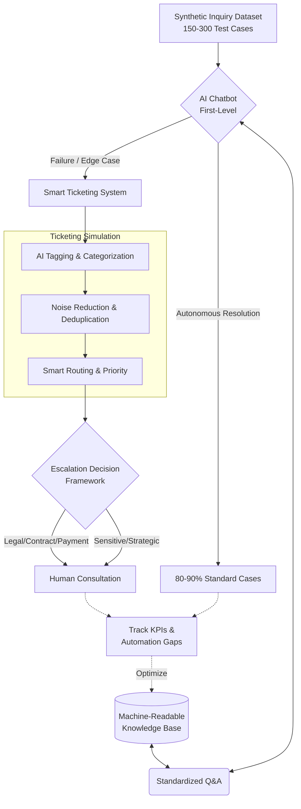

```mermaid

graph TD
    %% Input Layer
    Inquiry[Synthetic Inquiry Dataset<br/>150-300 Test Cases] --> Chatbot{AI Chatbot<br/>First-Level}
    
    %% Knowledge Layer
    KB[(Machine-Readable<br/>Knowledge Base)] <--> Retrieval(Standardized Q&A)
    Retrieval <--> Chatbot
    
    %% Resolution Logic
    Chatbot -->|Autonomous Resolution| Resolved[80-90% Standard Cases]
    Chatbot -->|Failure / Edge Case| Ticketing[Smart Ticketing System]
    
    %% Ticketing Logic
    subgraph Ticketing_Operations [Ticketing Simulation]
        direction TB
        Tag[AI Tagging & Categorization]
        Noise[Noise Reduction & Deduplication]
        Route[Smart Routing & Priority]
        Tag --> Noise --> Route
    end
    
    Ticketing --> Tag
    
    %% Escalation Framework
    Route --> Decision{Escalation Decision<br/>Framework}
    
    Decision -->|Legal/Contract/Payment| Human[Human Consultation]
    Decision -->|Sensitive/Strategic| Human
    
    %% Monitoring Loop
    Human -.-> KPI[Track KPIs &<br/>Automation Gaps]
    Resolved -.-> KPI
    KPI -.->|Optimize| KB
```

# TODO
- build a chatbot to answer 90% standard question
- build a ticket system to reply email