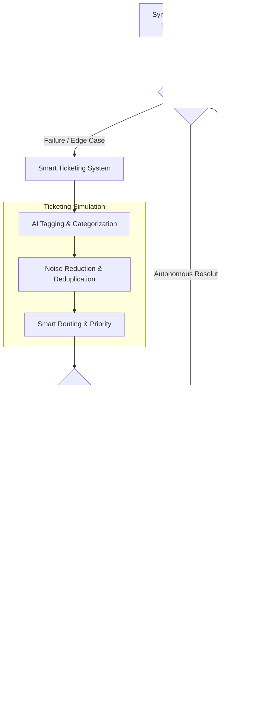

# TODO
- build a chatbot to answer 90% standard question
- build a ticket system to reply email

## Comprehensive Knowledge Base (XU University)

The project includes a production-ready RAG system with **persistent storage** that indexes **all content** from `https://xu-university.com/`.

### Documentation Map

- **Primary (developer + architecture):** `README.md`
- **Primary (deployment + operations):** `DEPLOYMENT.md`
- **Lightweight index page:** `KNOWLEDGE_BASE.md`
- **Lightweight storage note:** `PERSISTENT_STORAGE_SUMMARY.md`

### Quick Start

**1. Install dependencies:**
```bash
pip install -r requirements.txt
```

**2. Build the knowledge base (required once):**
```bash
python -m student_service.rebuild_kb
```

**3. Query the knowledge base:**
```bash
python -m student_service.ask "What bachelor programs are offered?"
# or
adk run student_service
```

### Key Features

- **Persistent Storage**: Index saved to disk (`.knowledge_base_index.pkl`)  
- **Manual Rebuild**: Developers control when to update the index
- **No Auto-Refresh**: Queries use cached index for fast response
- **Comprehensive**: 170+ HTML pages + 30+ PDF documents indexed

### Coverage

- **170+ HTML pages**: All bachelor/master programs, admissions, student life, careers
- **30+ PDF documents**: Program modules, admissions requirements, fee structures, career services
- **Multi-level discovery**: Sitemap parsing + recursive link crawling (depth-3)
- **Manual refresh**: Rebuild only when you run `python -m student_service.rebuild_kb`

### Architecture

**Core Components:**
- `WebsiteRAG` class in [student_service/rag.py](student_service/rag.py)
  - Sitemap + recursive HTML link discovery
  - PDF text extraction (validates PDF headers, skips invalid files)
  - **LangChain + ChromaDB** vector retrieval with local hashing embeddings
  - Boosts for pricing/fee queries and program-specific keywords
- `search_xu_university_knowledge()` tool in [student_service/agent.py](student_service/agent.py)
  - Wraps RAG retrieval for ADK agent integration
  - Returns structured JSON: status, sources (URL, title, content, type)

### Usage

**Command-line query:**
```bash
python -m student_service.ask "how much is the fee of Industry 4.0 MSc program"
```

**Python API:**
```python
from student_service.agent import search_xu_university_knowledge
result = search_xu_university_knowledge("What bachelor programs are available?")
print(result["sources"])  # List of relevant source dicts with URLs and content
```

**ADK Agent:**
```bash
adk run student_service
# Ask: "Tell me about the Data Science master program"
```

### Batch Testing

Use the built-in batch script to run custom question sets and save answers.

**Questions file (editable):**
- `test/fixtures/questions.txt` (one question per line)

**Run batch test:**
```bash
python test/run_batch_queries.py \
  --questions-file test/fixtures/questions.txt \
  --output test/results/results_$(date +%Y%m%d_%H%M%S).jsonl
```

**Output location:**
- `test/results/` (generated `.jsonl`/`.json`/`.csv` files)

### Features

- **Comprehensive indexing**: Priority sorting for master/bachelor and PDF resources
- **Format support**: HTML pages + PDF documents (with pypdf parsing)
- **Persistent storage**: Index saved to disk and loaded on demand (no rebuild unless triggered)
- **Smart retrieval**: 
  - Query-aware reranking (e.g., fee questions prioritize fee-bearing chunks)
  - PDF/webpage blend (ensures diverse source types)
  - Source deduplication with best-chunk selection
- **Performance**: ~50-80s initial index build, then instant load from disk

### Configuration

Edit [student_service/rag.py](student_service/rag.py) `WebsiteRAG.__init__()`:
- `timeout_seconds`: HTTP request timeout (default: 15s)
- `index_path`: Custom path for index file (default: auto)
- `collected_txt_path`: Custom path for collected text export (default: auto)